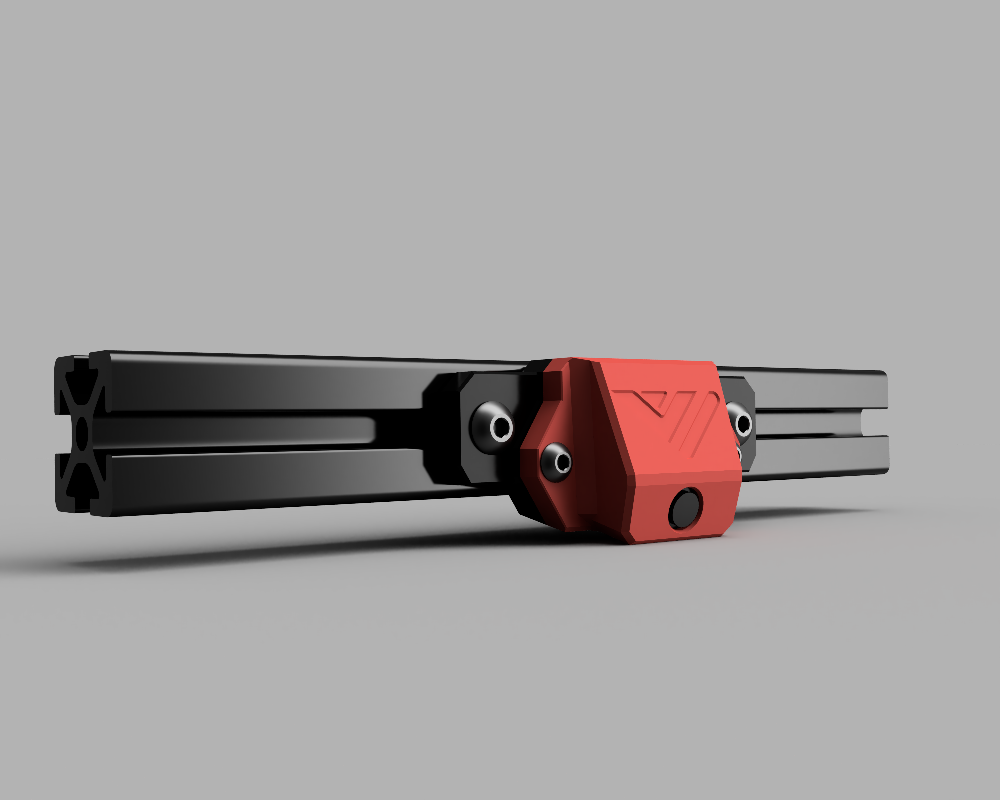

### VzBoT 3DO_USB-Camera mount
Designed to work with both AWD and 2WD versions of the VzBot-Vz330

### BOM
2 pcs M3x6 (to clamp the camera to the housing)

2 pcs M3x8 + 2 pcs M3 heat-inserts (to mount the housing to baseplate)

2 pcs M4x10 + t-nuts (mounting camera to frame)

Design by Sondre Botnen
